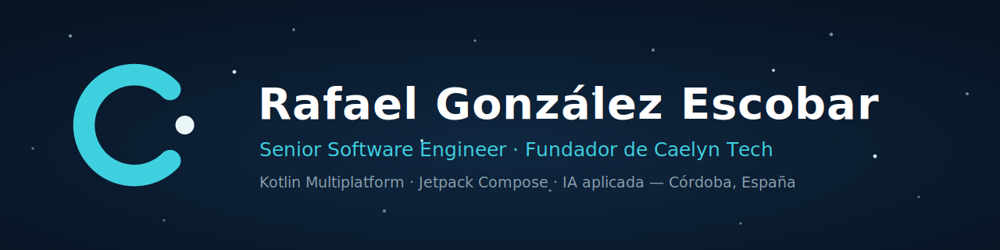
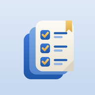
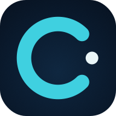
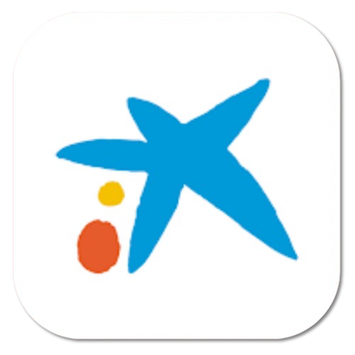
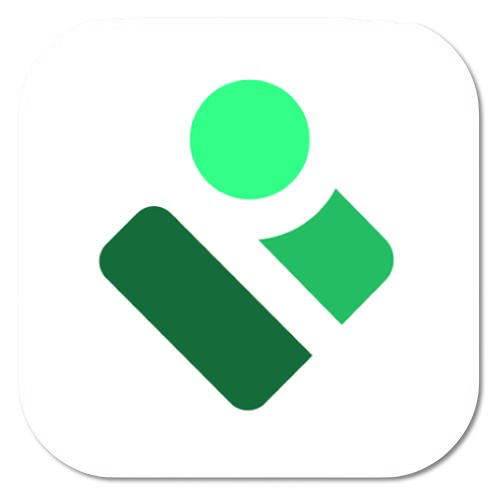
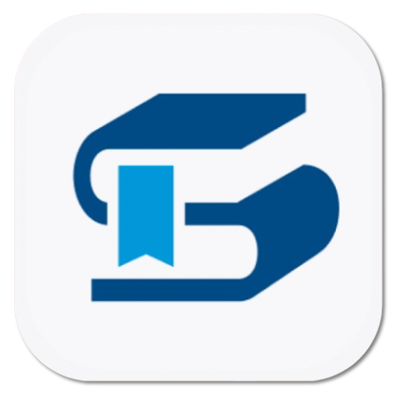
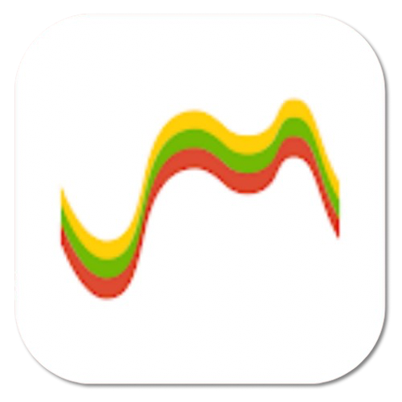
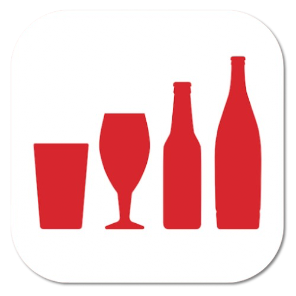

  

## Hola, soy Rafa 👋

**Senior Software Engineer** y fundador de **[Caelyn Tech](https://rafaelge96.github.io/caelyn-tech/)**. De día desarrollo apps móviles en productos de banca, administración pública y gran consumo; el resto del tiempo construyo mis propios productos: apps nativas y multiplataforma con IA integrada, desde Córdoba para el mundo. 🛰️

- 🚀 **Ahora**: publicando las apps de Caelyn Tech — Kotlin Multiplatform + IA
- 🎯 **Especialidad**: arquitecturas escalables (MVVM, Clean Architecture, modularización), CI/CD y buenas prácticas
- 🧭 **Cómo trabajo**: entender el problema real, simplificar la solución y no perder nunca de vista al usuario

## 🛰️ Productos propios

| | Proyecto | Stack | Estado |
|:---:|---|---|:---:|
|  | **Oremus** — oraciones y devocionario diario | Kotlin · Compose |  |
|  | **La Constitución** — estudia la CE con tests e IA | KMP · Compose · IA |  |
|  | **Auxiliar Administrativo** — preparación de oposiciones | KMP · Compose · IA |  |
|  | **Administrativo del Estado** — preparación de oposiciones | KMP · Compose · IA |  |
|  | **Caelyn Tech** — marca, web y centro de privacidad | HTML · CSS · JS |   |

## 💼 He construido para

  &nbsp;
  &nbsp;
  &nbsp;
  &nbsp;
  

## 🧰 Stack

## 📊 Actividad

  
  

## 📫 Contacto

---

⭐ Construido con la misma estética que <a href="https://rafaelge96.github.io/caelyn-tech/">Caelyn Tech</a> — azul noche y cian, como un amanecer en órbita.

